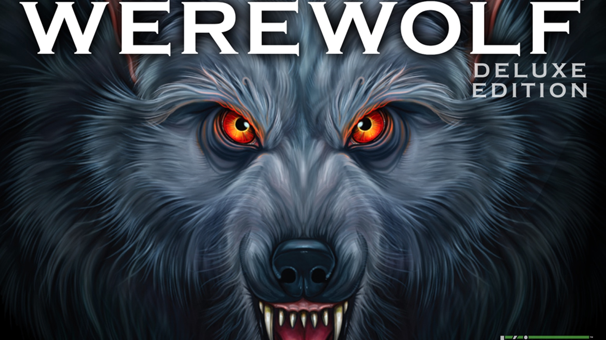

# Ultimate Werewolf Game Generator

[](https://forthebadge.com)
[](https://forthebadge.com)

This project aims to help Ultimate Werewolf game master generate interesting and unique decks without having to manually sift through the cards manually. Be warned, large teams (>25) might fry your CPU..._my bad_.

The program will generate an even team based on the team size that you provide it with. Currently, all cards and values are stored in a JSON file that you can easily edit. That way, if you do have an expansion, you can change it there.



## Usage

Copy this repository to your local machine by cloning it or downloading the zip file

```bash
git clone https://github.com/andrewboyley/ultimate-werewolf-generator.git
```

Make sure that you have python installed on your system and then simply open a terminal and run

```bash
cd ultimate-werewolf-generator
python3 main.py
```

It will ask you for a team size after which it will output the deck as follows:

| Card            | Value | Quantity |
| --------------- | ----- | -------- |
| Werewolf        | -6    | 3        |
| Mystic Seer     | +9    | 1        |
| Mad Bomber      | -2    | 1        |
| Huntress        | +3    | 1        |
| Hoodlum         | 0     | 1        |
| Cult Leader     | +1    | 1        |
| Aura Seer       | +3    | 1        |
| Apprentice Seer | +4    | 1        |

## Current limitations

There may be some edge cases in the deck generation that I have not accounted for as of yet. Right now, only Masons are handled uniquely (there can not be only one Mason). Expanding the generator to match the game rules is a feature that I will continuously work on.

## Planned features

- The generator ouputs the deck in a Markdown format which means that it would be the perfect candidate for a Discord bot
- I want to include all expansions and extra cards
- Make this into an all in one Ultimate Werewolf game manager
- Create a web UI
